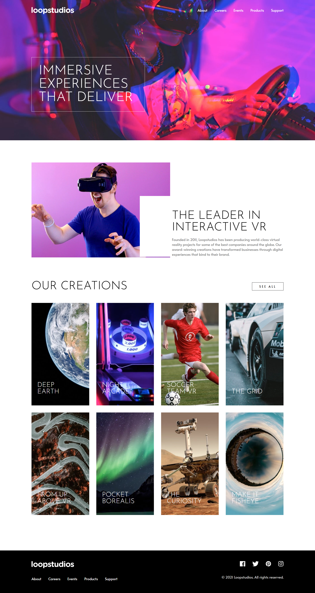

# Frontend Mentor - Loopstudios landing page solution

This is a solution to the [Loopstudios landing page challenge on Frontend Mentor](https://www.frontendmentor.io/challenges/loopstudios-landing-page-N88J5Onjw). Frontend Mentor challenges help you improve your coding skills by building realistic projects. 

## Table of contents

- [Overview](#overview)
  - [The challenge](#the-challenge)
  - [Screenshot](#screenshot)
  - [Links](#links)
- [My process](#my-process)
  - [Built with](#built-with)
  - [Useful resources](#useful-resources)
- [Author](#author)

## Overview

### The challenge

Users should be able to:

- View the optimal layout for the site depending on their device's screen size
- See hover states for all interactive elements on the page

### Screenshot

### Links

- Solution URL: [Loopstudios Solution](https://www.frontendmentor.io/solutions/loopstudios-landing-page-gBsE3zTraw)
- Live Site URL: [Loopstudios Live Site](https://mjspitta.github.io/loopstudios-landing-page/)

## My process

### Built with

- Semantic HTML5 markup
- CSS custom properties
- Flexbox
- CSS Grid
- SASS

### Useful resources

- [Window: resize event](https://developer.mozilla.org/en-US/docs/Web/API/Window/resize_event) - This helped me with changing the images due to the screen size. Where both mobile and desktop images were provided for the creations.
- [The Dialog element](https://developer.mozilla.org/en-US/docs/Web/HTML/Reference/Elements/dialog) - This helped with the Modal for the hamburger menu.

## Author

- Frontend Mentor - [@MJspitta](https://www.frontendmentor.io/profile/MJspitta)
- Twitter - [@madu_jang](https://x.com/madu_jang)